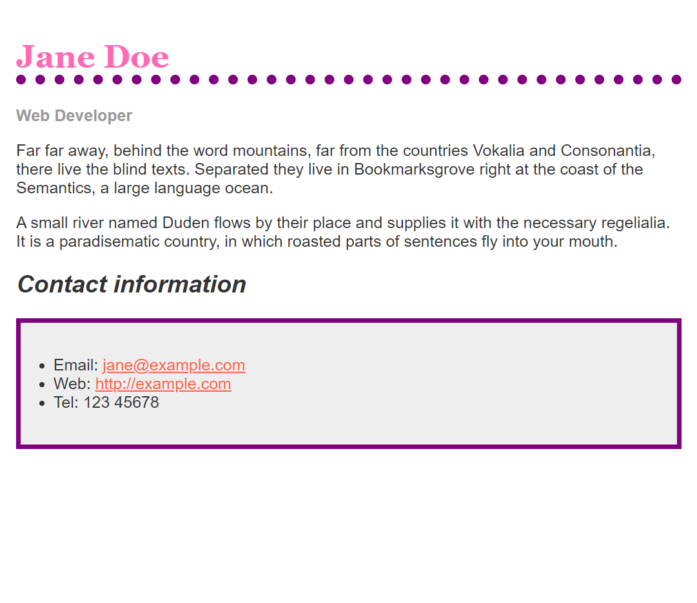

# Styling a biography page

- [Assessment: Styling a biography page](https://developer.mozilla.org/en-US/docs/Learn/CSS/First_steps/Styling_a_biography_page)

Format simple text documents using CSS to add your own style to them.

The following screenshot shows what the page looks like after styling with CSS. \
