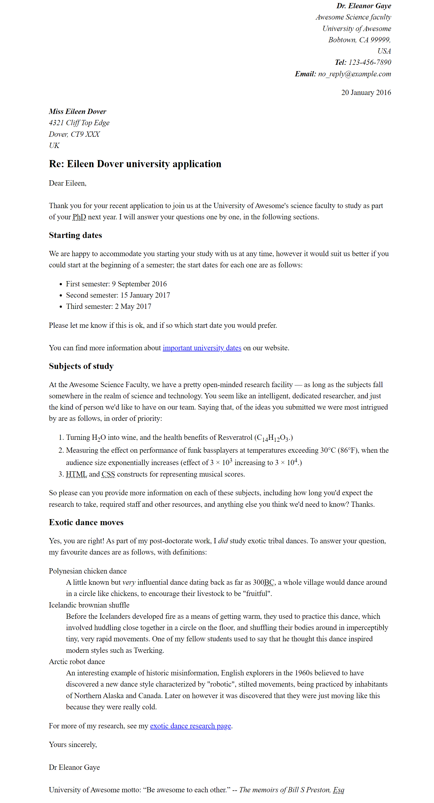

# Marking up a letter

- [Assessment: Marking up a letter](https://developer.mozilla.org/en-US/docs/Learn/HTML/Introduction_to_HTML/Marking_up_a_letter)

Mark up a letter that needs to be hosted on a university intranet. The letter is a response from a research fellow to a prospective PhD student concerning their application to the university.

The following screenshot shows an example of what the letter look like after being marked up. \
 

