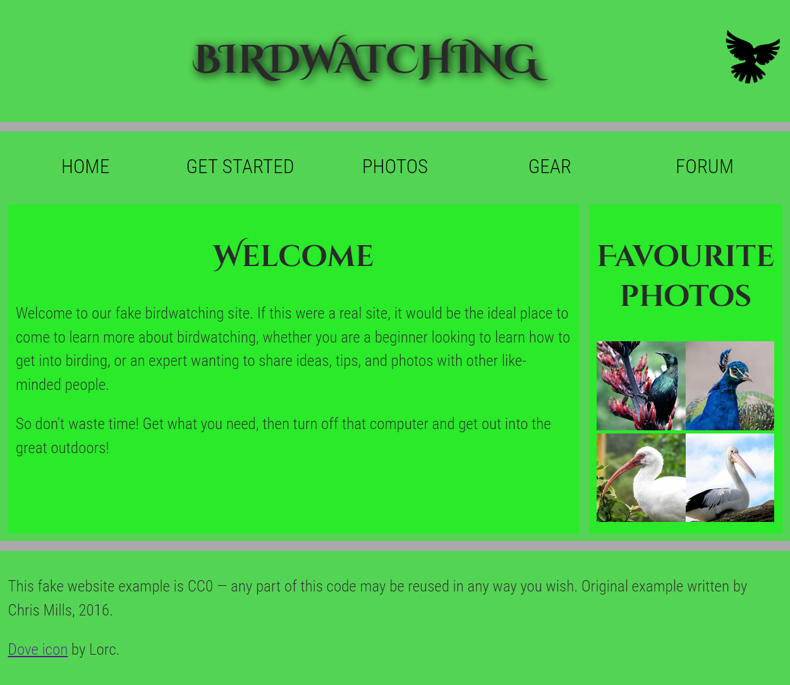

# Structuring a page of content

- [Assessment: Structuring a page of content](https://developer.mozilla.org/en-US/docs/Learn/HTML/Introduction_to_HTML/Structuring_a_page_of_content)

Take the content for the homepage of a bird watching website and add structural elements to it so it can have a page layout applied to it.

The following screenshot shows what the page looks like after being marked up. \
 

