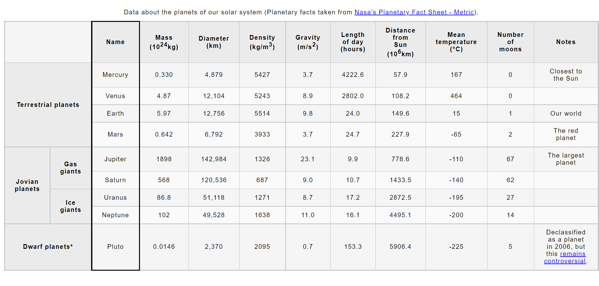

# Structuring planet data

- [Assessment: Structuring planet data](https://developer.mozilla.org/en-US/docs/Learn/HTML/Tables/Structuring_planet_data)

We provide you with some data on the planets in our solar system, and get you to structure it into an HTML table.

The following screenshot shows what the data look like after being structured into table. \

