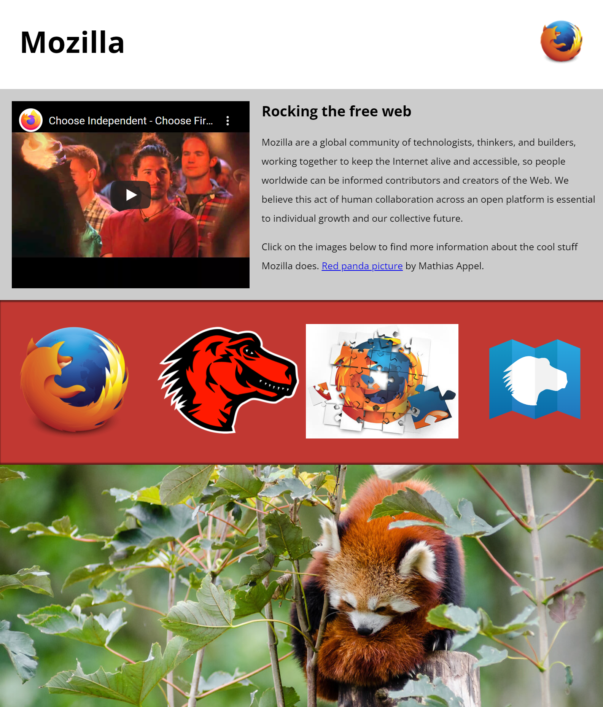

# Mozilla splash page

- [Assessment: Mozilla splash page](https://developer.mozilla.org/en-US/docs/Learn/HTML/Multimedia_and_embedding/Mozilla_splash_page)

In this assessment we are presenting you with a mostly-finished Mozilla splash page, which aims to say something nice and interesting about what Mozilla stands for, and provide some links to further resources. \
Unfortunately, no images or video have been added yet — this is your job! \
You need to add some media to make the page look nice and make more sense.

The following screenshots show what the splash page looks like under wide and narrow (400px) screen sizes, respectively. \

 
 

